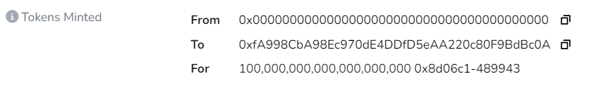

# Swisstronik Challenge #4

## Tasks

1. **Deploy an ERC20 Token**
2. **Mint Tokens**
3. **Transfer at least 1 of your ERC20 tokens to 0x16af037878a6cAce2Ea29d39A3757aC2F6F7aac1**

---

## Transactions

### Deploy Swisstronik Contract

**Command:**

```shell
npx hardhat run scripts/deploy.js --network swisstronik
```

**Response:**
Swisstronik contract deployed to [0x8d06C11708107Cc9198bB2a5837273741e489943](https://explorer-evm.testnet.swisstronik.com/address/0x8d06C11708107Cc9198bB2a5837273741e489943)

---

### Mint Tokens

**Command:**

```shell
npx hardhat run scripts/mint.js --network swisstronik
```

**Transaction Link:**
[View Transaction](https://explorer-evm.testnet.swisstronik.com/tx/0x8a60b67cee6dde3c3515eb72c05317c7ca977b2d9da089041cd7fbc6f641dff8)

---

### Transfer ERC20 Tokens

**Command:**

```shell
npx hardhat run scripts/transfer.js --network swisstronik
```

**Transaction Link:**
[View Transaction](https://explorer-evm.testnet.swisstronik.com/tx/0x8b8f2e835c223381a38862fe2c034e7d65168f9c7729d8ff1301ee0138f6564e)

---

### Check Total Token Balance

To verify the success of the transfer transaction, a script was created to check the total balance of tokens before and after the transfer.

**Command:**

```shell
npx hardhat run scripts/getBalance.js --network swisstronik
```

**Response:**

- Token balance before running the transfer.js script: 100,000,000,000,000,000,000
- Token balance after running the transfer.js script: 90,000,000,000,000,000,000

The Token balance is represented in the following format, indicating 100 tokens before running the script and 90 tokens after running the script.



The difference in the number of tokens confirms that 10 ERC20 tokens were successfully transferred to the address `0x16af037878a6cAce2Ea29d39A3757aC2F6F7aac1`.
